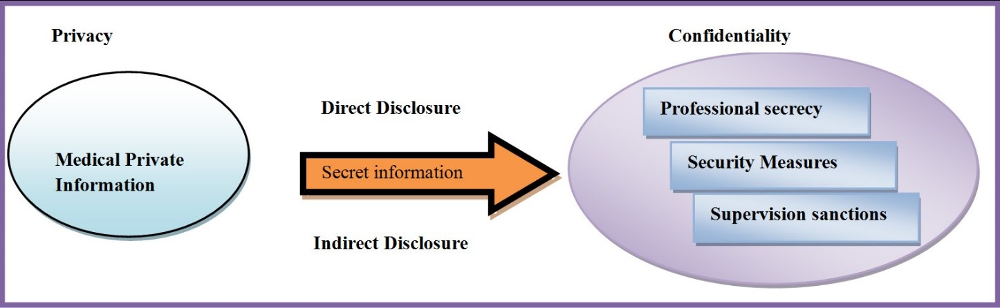
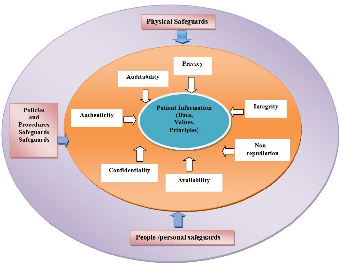

# Digital-Healthcare-Chain
This project is based on blockchain. 

## Problem in today’s healthcare
Today, Healthcare in advanced societies is a complex ecosystem of
interconnected entities that are involved with patients, care providers, healthcare organizations and payers. It is one of the highest growths industries in the entire world. But the existing systems and solution create barriers and challenges that impede the efficient delivery of healthcare.

Among the problems in healthcare sharing of medical Records is a big issue. Whereas hospitals and clinics maintain electronic medical records, the systems are not interoperable across care centers and data sharing is extremely time consuming and inefficient. For example, care for a patient after hospital discharge often requires re-tests and repeat x-rays because the data does not reach the primary caregiver in time. Adding that traditional healthcare system has not have any cost transparency and not having any valid doctor accuracy rate. This distribution failure results in poor health outcomes. As an example, a U.S. study in colon cancer treatment found that better sharing of medical data could lead to cost savings of approximately 30%. Patients, though central to the healthcare ecosystem, do not have control over their own health data. Neither do they get easy access to the data nor do they get the visibility of who accessed their health data. Because data is in a few centralized systems and the data is valuable, Healthcare suffers from frequent data breaches. U.S. Department of Health and Human Services reported that more than 15.5 million Electronic Medical Records were breached in the U.S. in 2016.
In this solution we can take a system that the patient centric healthcare system whereas the traditional system is disease centric healthcare. In this system patient have control over their health data and they will show their data whom they want.

## This solution is based on Hyperledger Blockchain 
As blockchain maintains blocks of data and connects one block with its previous block with encryption, the data in a block is
immutable, that is, it cannot be altered. The access to data is
controlled by public key - private key pairs, so it is possible to restrict access and to identify access. This enables the blockchain system to be trusted and this in turns enables sharing of data with known parties.

In the healthcare situation, a blockchain can enable the patient to store their data, control the data and then provide access as needed to caregivers. The data is tamper-proof because of the immutability of the blockchain. The data can be provided to caregivers instantaneously on demand as the patient and caregiver are known to and trusted by each other. Caregivers need only get data from the patients and need not interface with multiple systems. 

The patient can give access to the data to caregivers as well as to other parties who may be interested in the data. In all cases, the patient knows who has access to the data. No other party can access the data.

Thus, blockchain provides an elegant solution to the problems identified above. Not only that, because the blockchain solution devised here also keeps a record of every access of the data, so an audit trail can be built in, thus increasing the confidence in the system. Because the patient owns the data, the patient can monetize the data by selling it directly to those who are willing to purchase the data without the intermediaries.

## Privacy and Security

Fig: Privacy and security in Healthcare system
 
 

The world’s adoption of patient-centric approach in the delivery of healthcare services has enabled the sharing of health information across the globe. This has opened up a number of privacy and security issues. Both health providers and patients are concerned with what information should be shared. Both expect that only authorized people should have an access to the health information. In addition to this, health information that has been shared on trust should be used for the sole intended purpose. It has therefore been noted that privacy and security of health information are paramount for the delivery of patient-centric systems. Besides privacy and security laws, healthcare providers as well as health consumers must take collaborative initiative to keep health information private and secure. Administrative, technical and physical controls can be implemented in order to protect health information. Funders should also put the formulation of privacy and security laws and policies as a priority in low-income countries.

Fig: Security of Blockchain based Healthcare system
 
 
Generally, privacy entails the ability of an individual or group to seclude themselves, or information about themselves. It is therefore an open secret that limited resources such as availability of health facilities, funding, access to good schools and other critical services in developing countries have an impact on the implementation of privacy policies for example, only 46% of citizens in Bangladesh live within a 5 km radius of any kind of health facility. Few health facilities lead to congestion that consequently compromises the privacy of patients. Shortage of qualified health professionals is a major challenge in developing countries. For instance, there are only 2 physicians per 100,000 population and 34 nurses and midwives per 100,000 population in Bangladesh. This has adverse impact on the delivery of the quality of healthcare services including maintaining privacy and confidentiality of patients. This means that a striking balance must be sought for patients to get quality healthcare services without sacrificing their right to privacy.

# Implementation

We can implement the above solution using a consortium
blockchain. A private blockchain can enforce verified access, that is,KYC (Know Your Customer) checks are carried out.
The heart of the system is the Hyperledger blockchain.
Hyperledger was chosen for the following:
•	Private, permissioned
•	Modular design – pluggable components
•	Smart contracts and chain code 
•	Multi-language support for smart contracts: Go, Java, JavaScript
•	Quarriable data (key-based and Json queries) 
Comparatively, Hyperledger was still nascent and somewhat opaque in its working. Due to these reasons, Hyperledger is the most widely used blockchain platform today.

Identical copies of the blockchain (which are called “nodes”) exist on servers belonging to multiple organizations that are part of the
consortium. They are not centralized under the aegis of just one
organization. The current servers are Amazon Web Services, but they can be on any other Cloud.

## Hyperledger Fabric code runs on handles the following:

•	Consortium of organizations can establish channels, agree on smart contract, and transact with Healthcare organization and patient. 
•	Application communicates with the channels peer nodes to initiate transection and access the ledger. 
•	Fabric uses public key infrastructure (PKI) to manage identities on blockchain networks. 
•	Organizations maintain membership service providers(MSP) which specify the certificate authorities trusted by the organizations. 
•	The ledger that all peer nodes maintain consists of two parts: the actual blockchain, and the world state. 
•	The committed transaction is then propagated to the peer nodes where their ledgers are updated. 
•	Organization agrees upon smart contracts which are then packages into chain code and deployed onto the channel. 
•	Allow for private transactions between a proper subset of organizations on a channel. 

Whereas there is a bit of System Administration such as the letting
participants create accounts and verifying their credentials, and,
determining whether all the nodes of the blockchain are functioning properly, the Administrator has no access to the health data. Use is made of Cosmos DB as an off-chain database. The blockchain stores de-identified health data with minimal information such as code numbers, whereas Cosmos DB stores de-identified health data suitable for data analytics. The patient profile information is also separately stored in Cosmos DB. So is publicly available information about caregivers. This split data model smoothly handles data analytics opportunities while ensuring data privacy and security.

## Market and partners

Based on end user, the blockchain technology in healthcare market is segmented into,
•	Healthcare payers
•	Healthcare providers
•	Pharmaceutical companies
•	Others
Based on application, the blockchain technology in healthcare market is segmented into,
•	Claims adjudication & billing management
•	Clinical data exchange & interoperability
•	Others

## Blockchain risk for Healthcare

The biggest concerns about implementing blockchain in healthcare are some well-known technological limitations and features of classical public blockchains:
•	Speed and scalability
•	Overall transparency and lack of confidentiality

As health data could accumulate to a huge number of transactions, plus speed of information exchange in healthcare is often literally a matter of life and death, the scalability issue is of one of the greatest concerns. 
However, this could be addressed by implementation of private blockchains (see above) where transaction speed could be improved and better controlled.
Also, one should also be aware that blockchain technology is still a developing and constantly improving rather than a fixed and completed one. There is more than one solution to most of these issues already in development or at practical implementation stages. 

## Governance and Architecture 

Within the digital domain, and more specifically the domain of digital network providers, the state has limited powers and new actors emerge. These new actors command others through network-making and networked power, in a multitude of continuously changing relationships. Individual ownership of governance is limited. Governance over and within this network is thereby differentiated. This problematizes that power is dispersed throughout the network and is dependent on clusters/alliances of actors that can change per topic. 

Fig: Governance and Architecture of Blockchain base Healthcare system sample
 
 
 

## Valuation and Distribution

A variety of possible use-cases for blockchain are coming into focus for healthcare, ranging from clinical to financial to administrative.
Traditional healthcare fee-for-service payment systems are overly complex and expensive from an administrative perspective. On average, payment administration accounts for about 14 percent of healthcare spending. Blockchain applications can definitely reduce the waste,, which leads a consortium of healthcare companies focused on accelerating innovation using blockchain.
Beyond fee-for-service, blockchain as a technical architecture can enable value-based payments to take off and thrive, some experts said.
Blockchain can enable a smart payment system to match the distributed care teams that will take responsibility for episode- and disease-centered payment models.
In a situation where a health plan and patient are dealing with a contract, the blockchain could automatically verify and authorize information, as well as the contractual processes, eliminating the back-and-forth between multiple parties. This would increase transparency and efficiency, leading to lower administration costs, faster claims processing and less money lost.

## Conclusion 

The system, in a true sense, empowers patients to control their own health data. Patients can import their health records in the system, store those in secure way, access those seamlessly, share selected health records with caregivers of their choice and remove such access, at any time.

Caregivers get easy access to a patient’s health data across various care centers. This helps in providing better care to patients avoiding issues due to health data silos.

The data can be used for analytics in an anonymized manner. Anonymized health data management offers the benefits of improving patient engagement with predictive modelling, better care coordination, and, improving population health outcomes by tracking current health trends.

